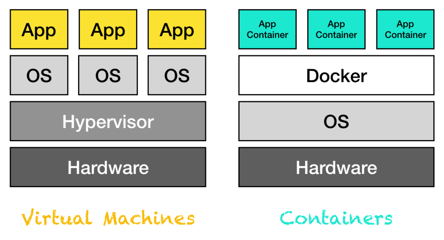

import { Card } from "@fusuma/client";

<Card
  left={
    <>
      <h1>Docker versus VM's</h1>
    </>
  }
  right={
      <>
        
        <a class="source" href="https://dev.to/frosnerd/docker-demystified-27kl">bron: docker demystified &mdash; frank rosner</a>
      </>
    }
/>