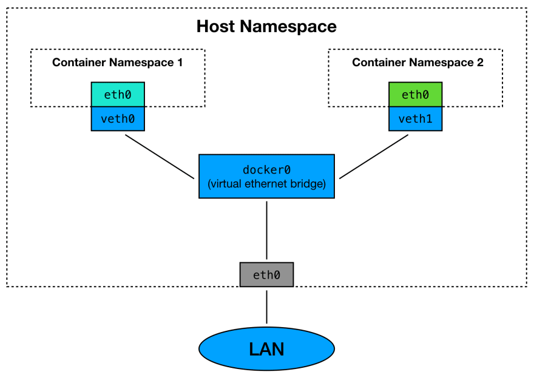

import { Card } from "@fusuma/client";

<Card
  left={
      <>
        
        <a class="source" href="https://dev.to/frosnerd/docker-demystified-27kl">bron: Docker Demystified &mdash; Frank Rosner</a>
      </>
  }
  right={
    <>
      <h1>Virtual Network Bridges</h1>
    </>
  }
/>