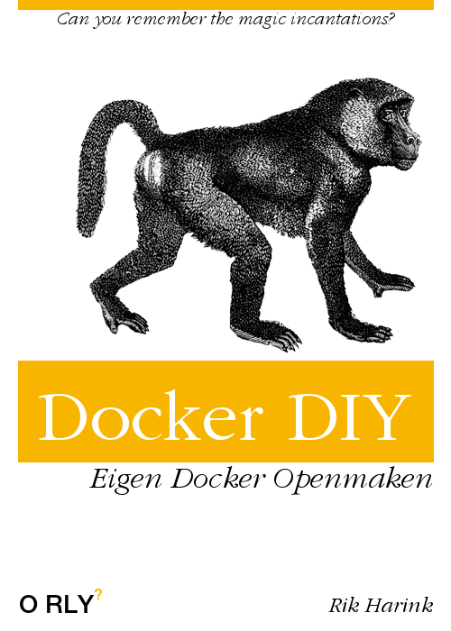

<!-- classes: bg-topicus -->
<!-- sectionTitle: Doe eens Zelf! -->

import { Card } from "@fusuma/client";

<Card
    left={}
    right={
        <>
            <h1>Doe eens Zelf!</h1>
        </>
    }
/>
